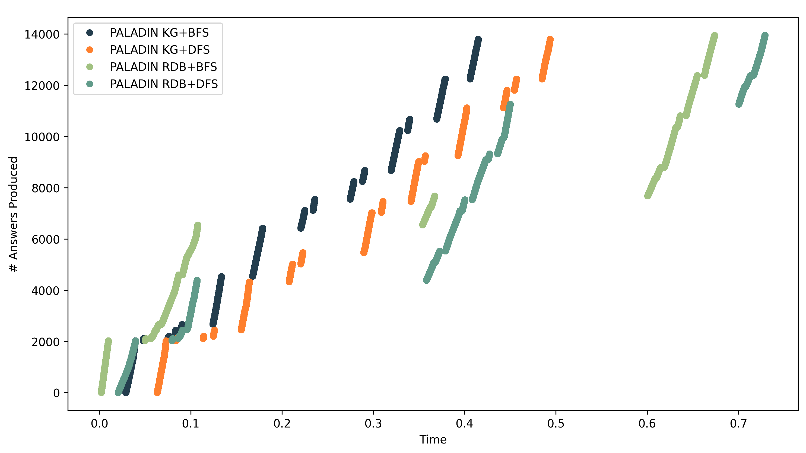
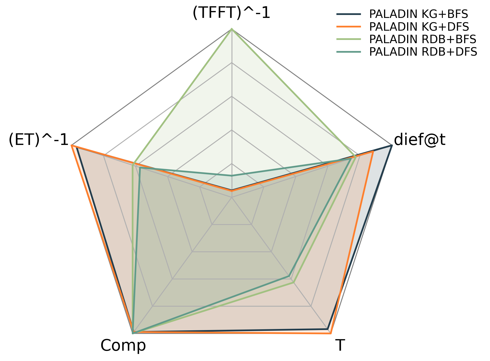
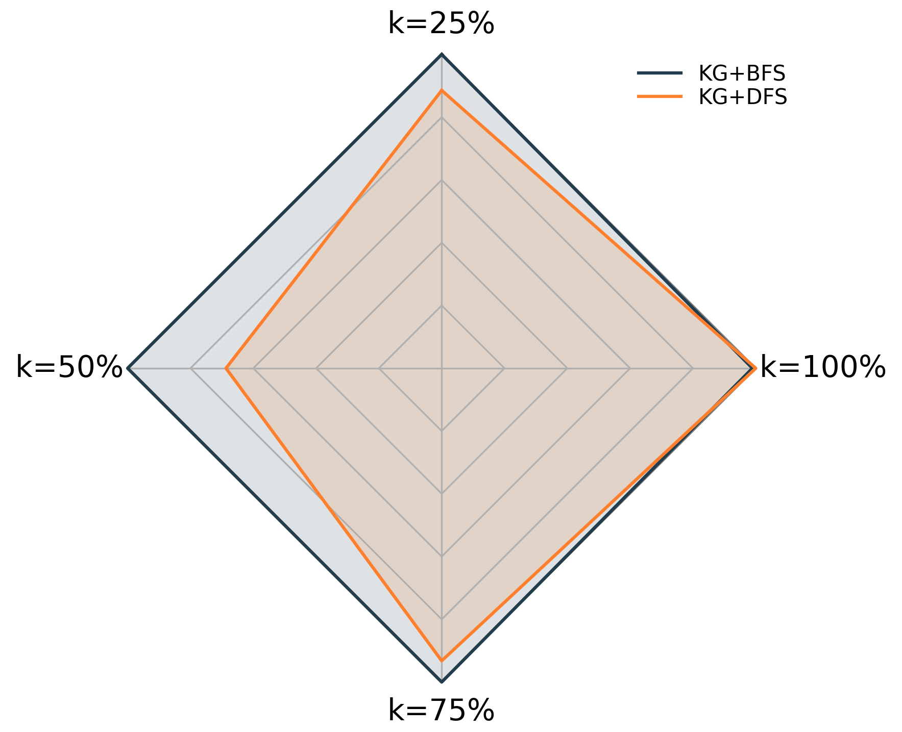
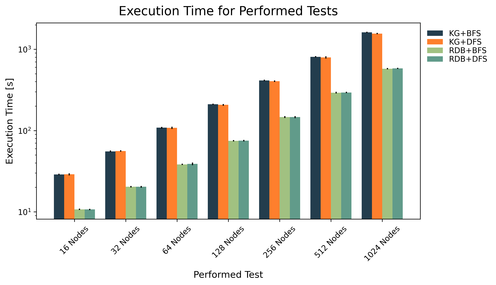

# 

PALADIN is a process-based data validator, i.e., it is capable of validating an entity at different stages of the process it undergoes.
PALADIN is _source-agnostic_, which means that data sources of different formats can be validated.

> [!NOTE]
> This repository contains the prototype implementation of PALADIN.
> The prototype is limited to RDF-based knowledge graphs accessible via SPARQL endpoints and relational databases in MySQL.

## PALADIN Architecture

<figure>
  
  <figcaption><i>Fig. 1:</i> <b>PALADIN Architecture</b></figcaption>
</figure>  

The PALADIN architecture (see Fig. 1) consists of two components, namely the _Schema Traversal Planner_ and the _Schema Traversal Engine_.
The input is a PALADIN schema (the constraints) and the population (entities from a datasource) which is validated.
The population can be sourced from different data formats, e.g., RDF-based knowledge graphs, relational databases, or NoSQL databases.
PALADIN returns for each shape in the PALADIN schema the set of valid and invalid entities.

__Shape Traversal Planner.__ This component generates an evaluation plan for the shapes in the PALADIN schema.
The process is guided by several features of the shapes including statistics related to the number of the shapes, the topology of the schema, the population size, and selectivity of the shapes.
If the PALADIN schema corresponds to a balanced tree, the schema will be evaluated following a _breadth-first_ strategy.
However, when the schema induces an imbalanced tree where the majority of the shapes are part of the left side of the tree, PALADIN follows a _depth-first_ strategy.
The experiments show that the selection of the traversal strategy impacts the continuous behavior of the engine.

__Shape Traversal Engine.__ This component is responsible for the evaluation of the PALADIN schema following the traversal strategy chosen by the _shape traversal planner_.
The engine follows a recursive evaluation model starting from the root shape of the schema.
The evaluation involves two steps:

1. __Target Population Generation.__ The target population is the intersection of the ancestor's population (either valid or invalid entities) and the shape's target query.
2. __Population Validation.__ The target population is split into the sets for valid and invalid entities based on the constraint query.

The output of the _shape traversal engine_ are the sets of valid and invalid entities for each shape in the PALADIN schema.

## Experimental Study

> [!NOTE]
> This is a brief summary of the experimental study presented in the paper.

The experimental study aims at answering the following research questions:

1. What is the impact of evaluating PALADIN schema following different tree traversal strategies?
2. Which parameters impact the performance of PALADIN?
3. What is the impact of the size and heterogeneity of the data sources on the performance of PALADIN?
4. How does the size of a PALADIN schema affect the validation time?

### Experimental Setup

__Data Sets.__ PALADIN is evaluated over 20 data sets.
Two of these data sets contain real-world data about breast cancer treatments; one in a relational database and the other as an RDF-based knowledge graph.
The remaining 18 data sets contain synthetic data based on the real-world breast cancer data.
Again, half of the data sets are stored in a relational database while the other half is a corresponding RDF-based knowledge graph.
The resulting nine different data sets differ in the size, i.e., number of patients modeled, and the truthfulness of the data.
Synthetic data sets modeling 1000 (_small_), 10000 (_medium_), and 100000 (_big_) patients are used.
The data sets varying in the data quality are called _clean_, _mid_, and _dirty_.

__PALADIN Schemas.__ The performance of PALADIN is evaluated using a PALADIN schema representing the treatment guideline for breast cancer patients with an amplified HER2 gene.
The schema contains 15 shapes and is imbalanced.
For the scalability study, three different PALADIN schemas are evaluated.
They all divide the population based on ranges over the ID and differ in the number of nodes in the schema.
The evaluated schemas contain 64, 256, and 1024 nodes, respectively.

__Configurations.__ Two different data formats are considered in the experimental study: (i) relational database (RDB), and (ii) RDF-based knowledge graph (KG).
Additionally, the traversal strategies BFS and DFS are evaluated.
This results in four configurations:

1. RDB+BFS
2. RDB+DFS
3. KG+BFS
4. KG+DFS

In the case of the real-world data, PALADIN is compared to Trav-SHACL [1], a state-of-the-art SHACL validator.
For the comparison with SHACL, 15 artificial classes representing the entities in all the shapes are added to the real-world KG.

__Metrics.__ The following metrics are reported:

1. __Average Validation Time:__ Average time in seconds that are needed to validate the PALADIN schema.
2. __Standard Deviation of the Validation Time__: Standard deviation of the time required to validate the PALADIN schema. 
3. __dief@t:__ Continuous efficiency in the first _t_ time units [2].
4. __dief@k__ Continuous efficiency while producing the first _k_ results [2].

__Experimental Setup.__ The main PALADIN schema is evaluated with all four configurations over all 20 data sets.
The three scalability schemas are evaluated with all PALADIN configurations over the data set _Mid Large_.
Together with the one case of using Trav-SHACL, this results in a total of 53 testbeds.
Each testbed is executed 10 times.
MySQL 8.1.0 and Virtuoso 7.20.3237 are used for hosting the RDB and KG data.
The entire experimental environment is dockerized.

### Results

#### Real Data

<figure>
  
  <figcaption><i>Fig. 2:</i> <b>Execution Time over Real Data</b></figcaption>
</figure>
<figure>
  
  <figcaption><i>Fig. 3:</i> <b>Answer Traces for Real Data</b></figcaption>
</figure>
<figure>
  
  <figcaption><i>Fig. 4:</i> <b>dief@t for Real Data</b></figcaption>
</figure>  

Figs. 2-4 present the results over the real-world data.
PALADIN is significantly faster than Trav-SHACL.
The KG configurations outperform the RDB configurations.
There is no real difference in the execution time for the two traversal strategies.
The continuous behavior shows that the RDB configurations generate the first result faster but are slower overall.

#### Synthetic Data

<figure>
  
  <figcaption><i>Fig. 5:</i> <b>Execution Time over Synthetic Data</b></figcaption>
</figure>
<figure>
  
  <figcaption><i>Fig. 6:</i> <b>dief@t for Synthetic Data</b></figcaption>
</figure>
<figure>
  
  <figcaption><i>Fig. 7:</i> <b>dief@k for Synthetic Data</b></figcaption>
</figure>  

Figs. 5-7 show the results of the evaluation of the synthetic data.
The RDB configurations are faster for small data sets but starting from medium-sized data sets, the KG configurations perform better.
Again, no significant difference in the overall execution time between the two traversal strategies can be observed.
For the continuous behavior only the KG configurations are reported.
When considering dief@t (higher is better), no difference can be seen.
However, when studying dief@k (lower is better), it is obvious that KG+DFS is producing the first half of answers faster than the KG+BFS configuration.
This is due to the imbalanced nature of the PALADIN schema as discussed above.

#### Scalability

<figure>
  
  <figcaption><i>Fig. 8:</i> <b>Execution Time Scalability Study</b></figcaption>
</figure>  

Fig. 8 shows that the execution time increases linear with the number of nodes in the PALADIN schema.
Due to the nature of the constraint queries (range query over primary key), the RDB configurations outperform the KG configurations.

> [!NOTE]
> This is a brief summary of the experimental study presented in the paper.
> Please, read the paper for a more elaborate result discussion.

## References
[1] Mónica Figuera, Philipp D. Rohde, Maria-Esther Vidal. Trav-SHACL: Efficiently Validating Networks of SHACL Constraints. In _Proceedings of the Web Conference 2021 (WWW '21), April 19-23, 2021, Ljubljana, Slovenia_. [DOI: 10.1145/3442381.3449877](https://doi.org/10.1145/3442381.3449877)

[2] Maribel Acosta, Maria-Esther Vidal, York Sure-Vetter. Diefficiency Metrics: Measuring the Continuous Efficiency of Query Processing Approaches. In _Proceedings of the International Semantic Web Conference, 2017_. [DOI: 10.1007/978-3-319-68204-4_1](https://doi.org/10.1007/978-3-319-68204-4_1)
